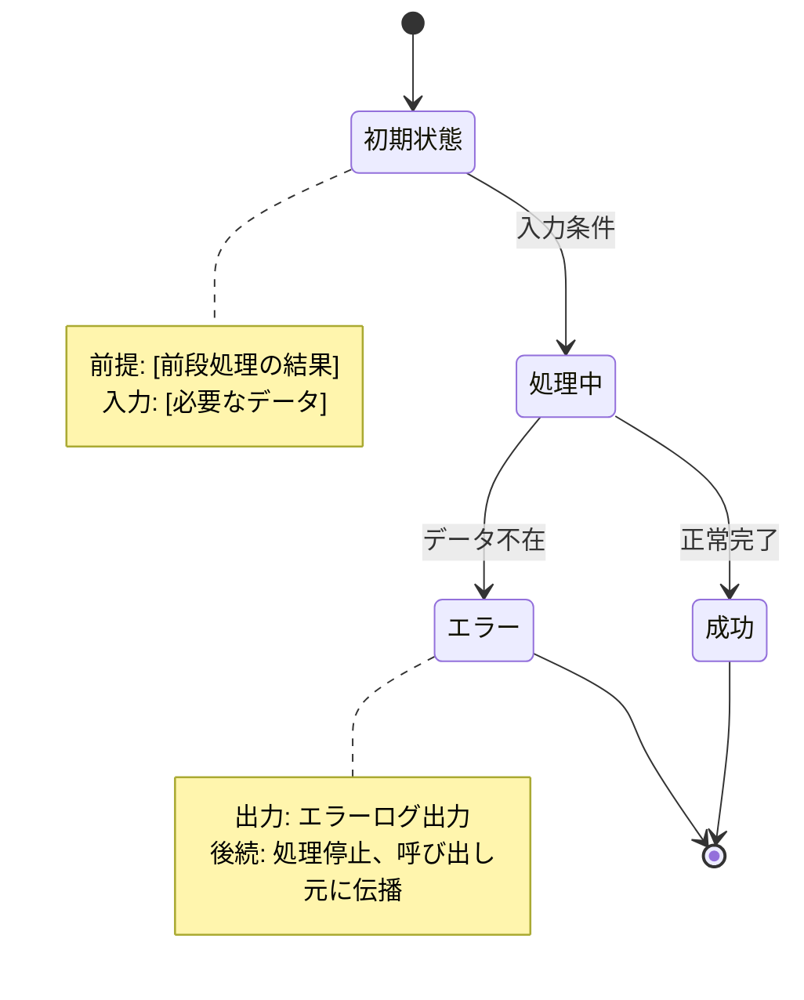

# Review Specification Workflow

仕様の対話後に、抽象化チェック（Aufheben）と複数の観点から仕様をレビューし、検証チェックリストを生成します。

## Usage

```
/review-spec
```

仕様の対話が完了した後に実行してください。

## Workflow

### Step 1: 現在のコンテキスト収集

```bash
# Issue番号の取得
BRANCH=$(git branch --show-current)
ISSUE_ID=$(echo "$BRANCH" | grep -oE '[0-9]+' | head -1)

# Issue内容を取得
gh issue view "$ISSUE_ID" --json title,body,comments
```

### Step 2: 既存の仕様ファイル確認

```bash
# 既存の仕様ファイルがあれば読み込み
SPEC_FILE=".claude/spec/issues/${ISSUE_ID}-*.md"
ls $SPEC_FILE 2>/dev/null
```

### Step 2.5: 抽象化チェック（Aufheben）

**検索なし・内省のみ**で、解決策を一段上の視点から検討する。

このステップでは、コード検索やWeb検索を**行わない**。純粋に目の前の仕様・解決策から抽象化を試みる。

#### 自問する3つの質問

1. **具体の把握**: この解決策は「何を」「どう」しているか？
2. **パターン化**: 「何を」を一段抽象化すると、どんなパターンになるか？
3. **波及効果**: そのパターンレベルで解決すると、今回以外に何が変わるか？

#### 例

| 具体 | パターン | 波及効果 |
|------|---------|---------|
| merge.md にコマンド列を直書き | 実行ロジックのドキュメント埋め込み | 他のスキル（finish, auto）も同様 → スクリプト化で一元管理 |
| 特定のエラーを try-catch で握りつぶす | エラー隠蔽パターン | 他の箇所でも同様の問題 → エラー伝播ポリシーの策定 |

#### 出力

```markdown
## 抽象化チェック結果

### 検出されたパターン
| 具体的な解決策 | 抽象パターン | 波及する箇所 |
|---------------|-------------|-------------|
| [具体] | [パターン名] | [他に影響する箇所] |

### 上位解決策の提案
- [ ] [パターンレベルで解決する場合の提案]

### 判断
- ✅ 現在の解決策で進める（パターンの波及が限定的）
- ⚠️ 上位解決策を検討すべき（理由: [理由]）
```

**注意**: このステップの結果（検出されたパターン、上位解決策の提案）は、Step 3 の各サブエージェントに渡す。

---

### Step 3: サブエージェントを並列実行

**Task tool でサブエージェントを並列起動**し、それぞれ異なる観点でレビューを行います。

各サブエージェントには以下を渡します：
- Issue のタイトルと本文（目的・仕様）
- これまでの対話で決まった仕様内容
- 既存の仕様ファイル（あれば）
- **Step 2.5 の抽象化チェック結果**（検出されたパターン、上位解決策の提案）

#### 3-1. 実現性レビュー（Feasibility Review）

Task tool で `subagent_type=general-purpose` を使用。

レビュー観点：
- **既存資産の再利用**: 同様の機能・パターンが既に存在するか。流用・拡張できるか
- **前段処理の結果活用**: 既存の処理結果（キャッシュ、中間データ）を再利用できるか
- **依存ライブラリ**: 新規追加が必要か、既存で対応可能か
- **外部依存**: API/サービスの認証・レート制限・SLA・障害時挙動は把握済みか
- **データスキーマ**: マイグレーションが必要か、既存データへの影響は
- **既存テストへの影響**: 変更により既存テストが壊れる可能性はあるか
- **ポータビリティ**: 他の環境（CI、他開発者のローカル）でも動作するか
- **リソース見積もり**: CPU/GPUメモリ、処理時間、ストレージ増加量の予測
- **代替案比較**: 検討した代替案と、現在の実装を選んだ理由

**必須出力: リソース見積もり、代替案比較**

出力形式：
```markdown
## 実現性レビュー結果

### リソース見積もり
| リソース | 予想値 | 備考 |
|---------|--------|------|
| CPUメモリ | ~2GB | [計算根拠] |
| GPUメモリ | ~8GB | [計算根拠] |
| 処理時間 | ~30分 | [条件: データN件] |
| ストレージ増加 | ~500MB | [出力ファイル内訳] |

### 代替案比較
| 案 | 概要 | Pros | Cons |
|----|------|------|------|
| A: 現在の実装 | [概要] | [メリット] | [デメリット] |
| B: 代替案1 | [概要] | [メリット] | [デメリット] |
| C: 代替案2 | [概要] | [メリット] | [デメリット] |

**選定理由**: 案Aを選択。理由: [具体的な理由]

### 技術的ブロッカー
- [リスト]

### 事前調査が必要な項目
- [リスト]

### 再利用可能な既存資産
- [リスト]
```

#### 3-2. 品質レビュー（Quality Review）

Task tool で `subagent_type=general-purpose` を使用。

レビュー観点：
- **処理フロー**: 入力→処理→出力の流れは明確か。分岐・ループの条件は定義されているか
- **データフロー**: データがどこで生成され、どこで変換され、どこで消費されるか明確か
- **状態遷移**: 各状態と遷移条件が定義されているか
- **前後接続**: 各状態の「前提条件」と「出力・後続」が明記されているか
- **正常系**: 主要なユースケースは網羅されているか
- **異常系（Fallback禁止）**: データ不在時にErrorを返す設計か。fallbackで続行しないか
- **異常報告**: 異常時に内容を明確に報告して停止するか
- **境界値・エッジケース**: 空、null、最大値、最小値等は考慮されているか
- **テスト戦略**: 単体/統合/E2Eのどのレベルでテストするか方針があるか
- **ログ戦略**: デバッグ可能なログ出力が設計されているか

**必須出力: 状態遷移図（mermaid形式）、ログ戦略**

```markdown
## 品質レビュー結果

### 状態遷移図


### ログ戦略

#### ログレベル設計
| レベル | 用途 | 例 |
|--------|------|-----|
| DEBUG | 開発時の詳細追跡 | 変数値、分岐判定 |
| INFO | 正常な処理の進捗 | 「ユーザー123の処理開始」 |
| WARN | 異常だが続行可能 | 「キャッシュミス、DBから取得」 |
| ERROR | 処理失敗 | 「ユーザー123が見つからない」 |

#### 進捗ログ設計
- 長時間処理: `処理名: N件中M件完了 (XX%)` 形式
- バッチ処理: 一定間隔で進捗出力

#### デバッグポイント
| 箇所 | 出力内容 |
|------|---------|
| 入口 | 関数名、引数の要約 |
| 分岐 | どの条件に該当したか |
| 出口 | 処理結果、所要時間 |
| エラー | 入力値、状態、スタックトレース |

#### 検証項目
- [ ] ログなしで処理が完了する箇所がないか
- [ ] エラー時に原因特定に十分な情報が出るか
- [ ] 進捗が分からないまま長時間待つ状態にならないか

### 未定義のエッジケース
- [リスト]

### テスト戦略への質問
- [リスト]
```

#### 3-3. 設計レビュー（Design Review）

Task tool で `subagent_type=general-purpose` を使用。

レビュー観点：
- **単一責任原則**: 1機能が複数責務を持っていないか
- **単一情報源の原則（SSOT）**: 同じ情報を複数箇所で定義していないか
- **既存コードとの一貫性**: 命名規則、ディレクトリ構造、コーディングスタイルが既存と整合するか
- **既存パターンとの整合**: プロジェクトで使われているデザインパターン・アーキテクチャに沿っているか
- **過度な複雑性（YAGNI）**: 現時点で不要な拡張性・抽象化を入れていないか
- **依存関係**: 不要な依存の追加や循環依存がないか
- **境界・インターフェース**: 他機能との境界が明確か。将来変更時の影響範囲が限定できるか
- **対症療法の回避**: 根本原因を特定しているか。挙動を上書きする形での修正を計画していないか
- **ファイル分割計画**: 各ファイルが単一責務を持ち、適切なサイズに収まる設計か

**必須出力: ファイル構成計画**

出力形式：
```markdown
## 設計レビュー結果

### ファイル構成計画
| ファイル | 責務 | 想定行数 |
|---------|------|---------|
| `user_service.py` | ユーザーCRUD | ~150行 |
| `user_validator.py` | バリデーション | ~80行 |

### 分割基準
- 1ファイル300行超過 → 分割検討
- 1関数50行超過 → 分割検討
- 複数責務 → 分割必須

### 設計上の懸念点
- [リスト]

### アーキテクチャ判断が必要な項目
- [リスト]
```

#### 3-4. Fallback計画チェッカー（Fallback Planning Check）

Task tool で `subagent_type=general-purpose` を使用。

レビュー観点：
仕様・状態遷移から、else/default/catchケースを抽出し、それぞれが：
- 意図的なfallback（許可すべき）
- エラーとして処理すべき（許可しない）
を判定して一覧化。

**許容するFallbackパターン:**
- 設定のデフォルト値（`config.timeout ?? 30000`）
- オプショナルな装飾（`user.nickname ?? user.name`）
- キャッシュミス（`cache.get(key) ?? fetch(key)`）
- ログレベル（`logLevel ?? "info"`）
- UI表示のプレースホルダ（`data.description ?? "説明なし"`）

**禁止するFallbackパターン:**
- ビジネスデータのデフォルト（`user ?? guestUser`）
- エラーの握りつぶし（`try: ... except: return None`）
- 存在チェックの回避（`items[0] ?? defaultItem`）
- 状態遷移のスキップ（`status ?? "pending"`）
- 外部データの補完（`apiResponse.data ?? []`）

出力形式：
```markdown
## Fallback分岐の確認

### 許可推奨（設定・UI・キャッシュ）
- [ ] `パターン` - 理由

### 要検討
- [ ] `パターン` - リスク説明

### 許可非推奨（エラーにすべき）
- [ ] `パターン` - 理由
```

#### 3-5. 妥当性検証チェッカー（Validation Checker）

Task tool で `subagent_type=general-purpose` を使用。

**WebSearch ツールを使用して、仕様の各項目の妥当性を検証します。**

レビュー観点：
- **ライブラリ選定**: 選択したライブラリが現在も推奨されているか、より良い代替はないか
- **設計パターン**: 採用したパターンがベストプラクティスに沿っているか
- **パフォーマンス見積もり**: 類似事例と比較して見積もりが妥当か
- **既知の問題**: 使用する技術に既知の脆弱性やバグがないか
- **エッジケース**: 見落としがちなエッジケースが他の事例で報告されていないか

検索例：
- `{ライブラリ名} vs {代替} 2024 comparison`
- `{パターン名} best practices pitfalls`
- `{技術名} known issues vulnerabilities`
- `{処理名} typical performance benchmarks`

出力形式：
```markdown
## 妥当性検証結果

### ライブラリ選定の検証
| ライブラリ | 検証結果 | 出典 |
|-----------|---------|------|
| `requests` | ⚠️ `httpx` の方がasync対応で推奨 | [URL] |
| `pandas` | ✅ 妥当 | [URL] |

### 設計パターンの検証
- Repository パターン: ✅ 適切（出典: [URL]）

### 見積もりの検証
- 処理時間30分: ✅ 妥当（類似事例で20-40分、出典: [URL]）

### 発見された懸念事項
- ⚠️ {ライブラリ} v1.2.3 にはメモリリークの既知問題あり（出典: [URL]）
- ⚠️ {パターン} 使用時は {エッジケース} に注意（出典: [URL]）

### 推奨アクション
- [ ] {ライブラリ} を {代替} に変更を検討
- [ ] {エッジケース} のテストを追加
```

#### 3-6. UI/UX レビュー（UI/UX Review）

**GUI/フロントエンド実装の場合のみ実行**。

Task tool で `subagent_type=general-purpose` を使用。

発動条件（いずれかに該当）：
- ファイルパターン: `**/*.html`, `**/*.css`, `**/*.js`, `**/templates/**`, `**/static/**`
- 機能説明に UI/GUI/画面/表示 等のキーワード
- CLIメッセージ、ログ出力、ユーザー向けメッセージの変更

レビュー観点：
- **一貫性**: 他の UI 要素と表示形式が統一されているか
  - 同種のメッセージ形式が揃っているか
  - 成功/エラー/警告の表現が統一されているか
- **直感性**: ユーザーが誤解しない表現か
  - オプショナル機能の無効状態がエラーに見えないか
  - 状態表示が現在の状態を正確に伝えているか
- **メリハリ**: 重要度に応じた視覚的優先順位が付いているか
  - 重要な情報が目立っているか
  - 補助情報が主要情報より目立っていないか
- **ベストプラクティス**: 業界標準のパターンに従っているか
  - エラーメッセージの形式
  - 進捗表示の方法
  - 状態遷移の通知
- **エラー状態**: エラーと正常状態が明確に区別できるか
  - 視覚的な区別（色、アイコン、プレフィックス）
  - 文言の区別
- **アクセシビリティ**: 基本的なアクセシビリティが考慮されているか
  - 色だけに依存しない区別
  - スクリーンリーダー対応（CLI出力の場合は構造化）

出力形式：
```markdown
## UI/UX レビュー結果

### 一貫性チェック
| 要素 | 現状 | 問題 | 改善案 |
|------|------|------|--------|
| [要素] | [現状の表示] | [問題点] | [改善案] |

### 直感性チェック
- ✅ / ⚠️ / ❌ [項目ごとの判定]

### メリハリチェック
- 情報の優先順位が適切か
- 補助情報の位置が適切か

### ベストプラクティス適合
| 項目 | 適合 | 備考 |
|------|------|------|
| [項目] | ✅ / ❌ | [備考] |

### エラー状態の区別
- 正常/エラーの区別方法: [説明]
- 問題点: [あれば]

### 改善提案
1. [具体的な改善案]
```

### Step 4: 結果の統合と出力

6つのサブエージェントの結果を統合し、以下の形式で仕様ファイルを生成：

```markdown
# Issue #N: タイトル

## メタ情報
- 作成日: YYYY-MM-DD
- 最終更新: YYYY-MM-DD
- ステータス: draft

## 状態遷移図

[品質レビューからの状態遷移図]

## リソース見積もり

| リソース | 予想値 | 備考 |
|---------|--------|------|
| CPUメモリ | [値] | [計算根拠] |
| GPUメモリ | [値] | [計算根拠] |
| 処理時間 | [値] | [条件] |
| ストレージ増加 | [値] | [内訳] |

## 代替案比較

| 案 | 概要 | Pros | Cons |
|----|------|------|------|
| 現在の実装 | [概要] | [メリット] | [デメリット] |
| 代替案1 | [概要] | [メリット] | [デメリット] |

**選定理由**: [具体的な理由]

## 妥当性検証結果

### ライブラリ選定
| ライブラリ | 検証結果 | 出典 |
|-----------|---------|------|
| [名前] | [結果] | [URL] |

### 発見された懸念事項
- [懸念事項と出典]

### 推奨アクション
- [ ] [アクション項目]

## ファイル構成計画

| ファイル | 責務 | 想定行数 |
|---------|------|---------|
| [ファイル名] | [責務] | [行数] |

### 分割基準
- 1ファイル300行超過 → 分割検討
- 1関数50行超過 → 分割検討
- 複数責務 → 分割必須

## ログ戦略

### ログレベル設計
| レベル | 用途 |
|--------|------|
| DEBUG | [用途] |
| INFO | [用途] |
| WARN | [用途] |
| ERROR | [用途] |

### 進捗ログ
- [進捗ログの設計]

### デバッグポイント
| 箇所 | 出力内容 |
|------|---------|
| [箇所] | [内容] |

## 検証チェックリスト

### 機能要件
- [ ] [正常系の要件]

### 状態遷移
- [ ] [各遷移の検証項目]

### 異常系
- [ ] [エラーケースの検証項目]

### 設計制約
- [ ] [設計レビューからの制約]
- [ ] 各ファイルが想定行数以内か
- [ ] ログ戦略に従ったログ出力があるか

## 承認済みFallbackホワイトリスト

| 箇所 | パターン | 理由 | 承認日 |
|------|---------|------|--------|
| [ユーザーが許可したもの] |

## 問題リスト

### 🔴 Critical（修正必須）
- [ ] [リスト]

### 🟡 Warning（確認必要）
- [ ] [リスト]

## 質問リスト

1. [未決定事項への質問]

## 新規依存パッケージ

### Python パッケージ（pyproject.toml に追加）
| パッケージ | バージョン | 用途 |
|-----------|-----------|------|
| [パッケージ名] | [バージョン] | [用途] |

### システムパッケージ（Dockerfile に追加）
| パッケージ | 用途 |
|-----------|------|
| [パッケージ名] | [用途] |

### 備考
- 動作確認後、マージ前に必ず永続化を確認すること
- `/commit/merge` で永続化チェックが行われる

## 変更履歴

### YYYY-MM-DD
- 初版作成
```

### Step 5: ユーザーへの確認とQA投稿

1. **Fallback分岐の承認**: 許可するfallbackをユーザーに選択してもらう

2. **質問への回答**: 質問リストの項目についてユーザーに確認
   - ユーザーが即座に回答できる場合 → 直接対話で解決
   - **ユーザーが不在・後で確認したい場合** → `/qa/ask` で Slack に質問を投げる

   ```bash
   # 例: 質問リストの項目をQAに投稿
   /qa/ask --type provisional --decision "案A" "質問リストの項目1について、案Aと案Bどちらが好ましいですか？"
   ```

3. **重要な決定事項のQA記録**
   - 仕様に関する重要な決定は、後から参照できるよう `/qa/ask` で記録することを推奨
   - 特に「なぜその選択をしたか」の理由を残す

4. **仕様ファイルの保存**: `.claude/spec/issues/{issue_id}-{description}.md` に保存

### Step 6: 仕様ファイルの保存

```bash
# ディレクトリ作成
mkdir -p .claude/spec/issues

# ファイル保存
# ファイル名: {issue_id}-{short-description}.md
```

## Output

- 仕様ファイルのパス
- 問題リストのサマリー
- 未解決の質問リスト
- 次のステップ（plan-mode への移行案内）

## Note

- このコマンドは `/issue/start` フローから自動的に呼び出される
- 2回目以降の実行では既存ファイルを更新し、変更履歴に記録
- 仕様が固まったら `/review-spec` を再実行して最終確認可能
