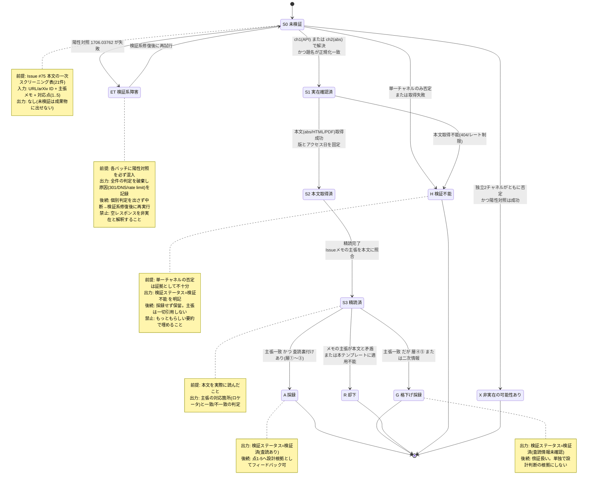

# Issue #75: survey: エージェント運用ノウハウの文献サーベイ

## メタ情報

- 作成日: 2026-07-30
- 最終更新: 2026-07-30
- 完了日: 2026-07-30
- ステータス: completed
- ブランチ: `survey/75-agentic-workflow-practices`
- Worktree: `worktrees/issue75`
- 判断ログ: `.spec/issues/75-auto-decisions.md`

## 抽象化チェック結果（Aufheben）

| 具体的な解決策 | 抽象パターン | 波及する箇所 |
|---|---|---|
| Web検索で得た文献リストを精読して採録 | **エージェント生成物を一次資料で検証するプロセス** | #73（negative result トリアージ）と同根。survey ラベルの全Issue、`docs/surveys/` の書式規約 |
| 文献知見を #70〜#74 の設計判断に反映 | 未検証の外部知見 → 検証済み設計根拠への変換 | `/issue-start` の survey 分岐、`/review-spec` の妥当性検証 |

**判断**: ✅ 現在の解決策で進める。プロトコル化そのものは #73 側の責務であり #75 の成果物はサーベイ文書。ただしサーベイ文書に**「検証ステータス」列を必須化**することで波及効果を先取りする。

## 状態遷移図

文献1本の状態遷移。終端状態がサーベイ文書の「検証ステータス」列の値域を定義する。



## リソース見積もり

| リソース | 予想値 | 備考 |
|---------|--------|------|
| メタデータ+abstract 全20件 | 1コール / 50KB / 0.42秒 | arXiv API `id_list` 一括クエリ。実測済み |
| abstract 総文字数 | 29,095字（平均1,454字） | 約8kトークン。実測 |
| 全文1件あたり | 34,568〜137,040字（平均86,911字） | 約22kトークン/件。6件実測 |
| 全文（重点8本） | 約70万字 ≒ 174kトークン | 採用案 (B) のコスト |
| WebFetch 呼び出し回数 | 10〜13回（+ カテゴリF 4〜6回） | 一括APIで全件検証を1回に圧縮 |
| 生成文書サイズ | 400〜600行 / 35〜55KB | 既存最大 `docs/devcontainer-internals.md` は243行 |
| フィードバックコメント | 5件（#70〜#74）× 1.5〜3KB | |
| 所要時間 | 25〜40分 | |

**却下した案 (A) の見積もり**: 全20本全文精読 = 約174万字 ≒ 435kトークン。本サーベイ対象の `2605.12366`（コンテキスト長に伴う見落ち増大）が警告する状況を自ら招くため却下。

## 代替案比較

| 案 | 概要 | Pros | Cons |
|----|------|------|------|
| A: 全20本を全文精読 | 全件の全文を通読 | 網羅性最大 | 435kトークン。コンテキスト劣化リスク。内容の大半が点1〜5に無関係 |
| **B: 実在性+abstract全件 → 全文は重点8本（採用）** | ①API 1コールで全件のID・正式タイトル・投稿日・査読状況を確定 ②abstract全件精読でメモの主張を検証 ③点1〜5直結の8本のみ全文 | 完了条件「全文献が一次資料で検証されている」を充足。コスト約1/3。査読状況を `arxiv:comment` から機械的に取得できる | abstractに載らない実験条件・数値は重点8本以外で取り逃す（→`検証範囲`列で明示すれば許容） |
| C: 点1〜5直結のみ深掘り | 8本前後のみ着手 | 最安・最速 | **完了条件を満たせない**。未検証文献を残すことは Issue の「注意」に反する |
| D: PDF経由で全件 | `/pdf/` を使用 | HTML欠損に依存しない | 抽出精度が低い（実測で abstract 抽出失敗）。20件で約30MBのバイナリ |

**選定理由**: **案B**。決定的な根拠は arXiv API の `id_list` 一括クエリが 20件を1コール0.42秒で返すと実測できた点。これにより「全件の実在性検証」は案Cと同等のコストで達成でき、案Cの唯一の利点が消える。同時に `arxiv:comment` から査読状況が機械的に取得でき、作業項目「一次情報と二次情報を明確に分離する」を推測でなく一次メタデータで実行できる。

**重点全文精読の対象8本**

| 文献 | 直結先 |
|------|--------|
| `2601.03315` Why LLMs Aren't Scientists Yet | #73（最優先） |
| `2604.02485` Failing to Falsify | #73 |
| `2604.11978` The Long-Horizon Task Mirage? | #72 |
| `2605.15425` Runtime-Structured Task Decomposition | #72 |
| `2605.12366` Classifier Context Rot | #74 |
| `2604.03527` Explainable Model Routing | #71 |
| `2605.06350` Is Escalation Worth It? | #71 |
| `2601.03878` Understanding Spec-Driven Code Generation | #70 / #72 |

## 妥当性検証結果

### 文献リストの実在性（review-spec 3-5 で実測、2エージェントが独立に検証・結論一致）

- Issue #75 の文献数は **21本**（arXiv 20 + Web 1 = agentsstandard.com）。「26本」は誤り
- **arXiv ID 20/20 が実在し、タイトルも一致**。架空IDはゼロ
- **Issue が警戒した「ID 不正確」は ID 水準では空振り**。リスクは主張水準に集中していた

### 査読ステータス（arXiv `comments` / `journal-ref` / `DOI` 欄で判定）

| 層 | 定義 | 本数 | 該当 |
|---|---|---|---|
| ① | 査読誌・トップ会議採択 | 2 | `2510.19973`(IEEE OJCOMS), `2605.02572`(ICML 2026) |
| ② | ワークショップ採択（軽量査読） | 2 | `2604.03527`(CHI 2026 HCXAI, Spotlight), `2605.15425`(Agentic SE WS) |
| ③ | プロトコルのみ査読済 | 1 | `2601.03878`(SANER 2026 Stage 1 Registered Report) |
| ④ | 非標準の実験的会場 | 1 | `2601.03315`(Agents4Science 2025、AI筆頭著者必須) |
| ⑤ | 査読情報未確認（arXiv メタデータ上） | 14 | `comments`/`journal-ref`/`DOI` いずれも空 |

**含意**: Issue の作業項目は「AGENTS.md 標準など査読を経ていないものは格下げ」とするが、実際は **70%(14/20) が査読情報未確認**で格下げ対象は AGENTS.md だけではない。特に最優先の C カテゴリ6本中、査読誌掲載は `2510.19973` の1本のみ。

### 発見された懸念事項（実測で確定した記述誤り3件）

| # | 対象 | 誤り | 正 |
|---|---|---|---|
| 1 | agentsstandard.com | 「nearest-file-wins」 | 全tierを global→project base→project active→folder の順に **concatenate**（置換ではない）。矛盾時のみ most specific が勝つ。かつ個人リポジトリ `nbiish/` 由来・標準化団体/バージョン/日付なし。業界標準の実体は `agents.md`（Linux Foundation 傘下 AAIF 管理） |
| 2 | `2601.03315` | 鍵括弧引用「最初の実験が negative でも、より確からしい説明は subtle な実装バグ」 | **abstract に存在しない**。全文で確認できなければ引用として掲載しない |
| 3 | `2605.12366` | 「見落とし2〜30倍」 | 条件欠落。原文は「**after 800K tokens** of benign activity」条件付き。⚠️ **Issue #74 本文には既に条件が正しく記載済み。#74 は触らない** |

タイトル相違5件（`2607.05775` / `2605.02572` は "Large Language Model(s)"、`2607.08964` / `2606.24177` は副題欠落、`2604.08290` は "Artificial Intelligence"）。

### 検証パイプライン自身の偽陰性（実測）

| # | 現象 | 対策 |
|---|---|---|
| F1 | `curl -L` 欠落で arXiv API が301を返し、実在確実な対照 `1706.03762` まで NOT_FOUND | `-L` を常用（根治）。陽性対照を検証ループ先頭で必ず走らせる |
| F2 | `2606.04967` は API で3回連続 `totalResults=0` だが abs ページは200で題名一致 | 非実在判定は独立2チャネル一致を必要条件とする |

### 推奨アクション

- [ ] 文献数の誤り（26→21）をサーベイ文書に明記
- [ ] タイトル5件を正式名に統一
- [ ] agentsstandard.com を訂正・格下げし出典を `agents.md` に差し替え
- [ ] `2601.03315` の鍵括弧引用を全文で検証、不可なら掲載しない
- [ ] `2605.12366` に 800K トークン条件を明記
- [ ] 査読ステータス5層を凡例1箇所に定義
- [ ] カテゴリF（引用ハルシネーション文献）を追加、上限6件

## ファイル構成計画

| ファイル | 責務 | 想定行数 |
|---------|------|---------|
| `docs/surveys/2026-07-30_agentic-workflow-practices.md` | サーベイ本編（**単一ファイル**）。調査方法／評価サマリー表／詳細分析／横断知見／各Issueへの含意／限界と未調査 | 400〜600 |
| `.spec/issues/75-agentic-workflow-practices.md` | 本仕様ファイル（コミット対象外） | — |
| `.spec/issues/75-auto-decisions.md` | 判断ログ（コミット対象外） | — |
| #70〜#74 の Issue コメント | 各Issue固有の設計判断への含意のみ。文献の主張本文は転記せずアンカー参照 | 各 15〜40 |

### 分割基準

- CLAUDE.md「成果物の保存場所」が `docs/surveys/YYYY-MM-DD_topic-name.md` とフラット1ファイルを規定 → **分割しない**
- **600行を超える見込みになった時点で停止しユーザーに分割可否を確認**（無断分割も無制限な肥大化も禁止）
- 文献ごとの記述深度は3段階（Tier1 全文精読 / Tier2 abstract / Tier3 目録1行＋除外理由）で制御し、21本が均一に膨らむのを防ぐ

### 章構成

```
# 文献サーベイ: エージェント運用ノウハウ
## 対象読者と読み方
## 調査範囲と方法          （検索の経緯／包含・除外基準／証拠の格付け凡例）
## 文献評価サマリー        （表: 文献 | 区分 | 層 | 存在検証 | 主張検証 | 検証範囲 | 関連Issue）
## 初期スクリーニングで判明した誤り
## 詳細分析                （### 1. 〜、Tier1 は 太字ラベル5項目の固定サブ構造）
## 横断的な知見
## 本テンプレートへの含意  （Issue番号＋論点名までの対応表）
## 本サーベイの検証手法の妥当性（カテゴリF）
## 限界と未調査
```

### 書式規約（既存 `docs/security.md` から踏襲）

| 規約 | 内容 |
|---|---|
| YAML front-matter | **なし** |
| 見出し | H1は1個。H3まで（H4は既存3文書で使用0件） |
| 項目内構造 | H4の代わりに太字ラベル＋コロン（`**主張**:` `**方法と対象**:` `**限界**:` `**適用**:` `**検証**:`） |
| サマリー先出し | 詳細分析の前に一覧表 |
| 引用 | 脚注 `[^1]` は使わない（既存3文書で0件）。インラインリンクのみ |
| アンカー | arXiv ID 由来の安定形（`#ref-2601-03315`）。見出し文言由来は使わない |
| 文体 | 日本語。断定調。英語専門用語は原語のまま |

## ログ戦略

サーベイ作業の監査可能な追跡記録として設計する。実体は (a) サーベイ文書内の検証台帳表、(b) Issue #75 への進捗コメント。

### ログレベル設計

| レベル | 用途 | 例 |
|--------|------|-----|
| DEBUG | 再現に必要な生情報 | 実行コマンド全文、HTTPステータス、リトライ回数 |
| INFO | 1文献ごとの確定判定 | `2601.03878: 実在 / 題名一致 / v1 / Registered Report → 採録` |
| WARN | 続行するが格下げ・要注意 | `2601.03315: 層④非標準会場 → 格下げ（Issueは最優先指定、齟齬あり）` |
| ERROR | 停止・成果物から除外 | `検証不能`、`主張が本文と矛盾` |
| FATAL | バッチ全体の判定破棄 | `陽性対照 1706.03762 が失敗 → 検証系障害。全判定を無効化し中断` |

**原則**: WARN 以上は必ずサーベイ文書に可視化する。ERROR/FATAL を握りつぶして「もっともらしい要約」で行を埋めることを禁止。

### 進捗ログ

- 形式: `検証フェーズ: 21件中 N件完了（実在確認 a / 検証不能 b / 非実在の可能性 c）` を Issue #75 にコメント
- フェーズ境界（実在検証 → 精読 → 採録判定 → 点1-5フィードバック）ごとに1回

### デバッグポイント

| 箇所 | 出力内容 |
|------|---------|
| 検証入口 | 対象ID、主張メモ、対応点、投入した陽性対照ID |
| チャネル分岐 | どのチャネルで解決したか、各チャネルの生ステータス |
| 題名照合 | Issue記載題名 / 実際の題名 / 正規化後の一致判定根拠 |
| 査読判定 | `journal-ref` と `comments` の生値 |
| 版固定 | 版番号、`published`/`updated`、アクセス日 |
| 精読出口 | 主張のロケータ（節・図表番号）、一致/不一致、適用先の点番号 |
| ERROR時 | 試行した全チャネルの生レスポンス要約、リトライ回数、陽性対照の結果 |

## 検証チェックリスト

### 機能要件

- [ ] `docs/surveys/2026-07-30_agentic-workflow-practices.md` が存在する
- [ ] 全21本（+ カテゴリF最大6本）が文献表に行として存在する
- [ ] 各行に `存在検証` / `主張検証` / `検証範囲` の3列が埋まっている（**空欄0件**）
- [ ] 査読ステータス5層の定義と判定根拠が凡例1箇所に記述されている
- [ ] 重点8本について全文精読の結果が記述されている
- [ ] #70〜#74 にフィードバックコメントが投稿されている

### 状態遷移

- [ ] `検証不能` の行が削除されず残っている
- [ ] `非実在の可能性あり` の行に独立2チャネル分の否定証跡＋陽性対照成功が記録されている
- [ ] 陽性対照 `1706.03762` の結果が記録されている
- [ ] 到達 arXiv version が全行に明記されている

### 異常系

- [ ] `abstract v{N}` の行に手法詳細・数値・比率が書かれていない
- [ ] 鍵括弧の逐語引用すべてにロケータ（`abstract` / `§n` / `vN`）が付いている
- [ ] arXiv ID の差し替えがない（あれば「Issue記載ID → 実ID」の対応が記録されている）
- [ ] 取得失敗・未検証を `検証済` と記録していない
- [ ] 無関係な文献を無理に関連づけていない（`適用なし` を正当な結果として記録）
- [ ] `2602.05930` が層①の信頼度前提を弱める含意が明記されている（都合の悪い知見の隠蔽なし）

### 設計制約

- [ ] 単一ファイルで、600行以内
- [ ] YAML front-matter がない / 見出しは H3 まで / 脚注を使っていない
- [ ] Issue コメントに文献の主張本文を転記していない（アンカー参照＋Issue固有の解釈のみ）
- [ ] #70〜#74 の**本文を編集していない**
- [ ] Issue #75 本文の文献リストを編集していない（注記1行の追記のみ）
- [ ] `.spec/` がコミット対象に含まれていない
- [ ] `scripts/quality-check.sh` を変更していない
- [ ] 総文献数が29本以下

## 承認済みFallbackホワイトリスト

| 箇所 | パターン | 理由 | 承認日 |
|------|---------|------|--------|
| 検証ステータス列 | 初期値 = `未検証`（悲観側デフォルト、空欄禁止） | 設定のデフォルト値 | 2026-07-30 |
| 査読状態列 | 確認不能時 `不明（未確認）` | UI表示のプレースホルダ。値の捏造ではない | 2026-07-30 |
| 一次資料取得 | タイムアウト／リトライ回数のデフォルト（最大3回、枯渇時は `検証不能` を記録） | 設定のデフォルト値 | 2026-07-30 |
| 一次資料取得 | ローカルキャッシュ再利用（取得日時と version を記録） | キャッシュミス | 2026-07-30 |
| 引用欄 | 長文の要約掲載（直接引用は逐語＋ロケータ、書式で区別） | 表示上の整形 | 2026-07-30 |
| 一次資料取得 | **同一 arXiv ID 内**での経路切替（html→abs→pdf、到達 version を記録） | ID を変えないトランスポート層リトライ | 2026-07-30 |
| 進捗報告 | 部分完了を「完了条件未達」と明記して Issue 報告 | fallback継続ではなく異常報告原則の実行 | 2026-07-30 |
| 適用可能性列 | 無関係と判断した場合 `適用なし` と記載して行を保持 | negative result の明示 | 2026-07-30 |

**ホワイトリスト外の一切の分岐は、該当行を `検証不能` / `未検証` / `不明` として残し、Issue #75 にコメント報告する**（＝エラーとして扱い、埋めない）。

### 絶対禁止事項（サーベイ品質のレッドライン）

1. 存在しない、または未取得の資料の内容を記述すること（ハルシネーション引用）。タイトルからの推測、事前知識による代替、もっともらしい節番号・ページ番号の生成を含む
2. 一次資料より Issue 本文のメモを優先すること
3. 取得に失敗した文献の行を削除・不言及にすること
4. 未検証に `検証済` と記録すること、査読状態を不明から「査読済み」に格上げすること
5. abstract のみの読解で、手法・実験条件・数値に依存する主張を採録すること
6. 文献の主張をテンプレート設計に都合よく曲げて関連づけること（確証バイアス）
7. arXiv ID の黙った差し替え
8. 完了条件のチェックボックスを実態と乖離した状態でチェックすること
9. 他Issueの本文を編集すること（#78 と並行稼働中。不可逆）
10. 範囲縮小・手順省略をユーザー確認なしに自己判断で行うこと

## 問題リスト

### 🔴 Critical（修正必須）

- [x] `scripts/quality-check.sh` がこのリポジトリで必ず失敗（EXIT=2, `No pyproject.toml found`）→ ユーザー承認により survey 向け代替チェックに置換。スクリプト自体は変更しない（#79 が担当）
- [ ] agentsstandard.com の「nearest-file-wins」記述が誤り（実仕様は階層 concatenate）→ 訂正して採録、出典は `agents.md` に差し替え
- [ ] `2601.03315` の鍵括弧引用が abstract に存在しない → 全文で検証、不可なら掲載しない

### 🟡 Warning（確認必要）

- [ ] #78 が並行稼働中（`worktrees/issue78`）。#70〜#74 の本文編集は禁止
- [ ] `.spec/` が `.gitignore` 未登録 → コミット対象から除外（恒久対応は #79）
- [ ] 出典不明の3主張（#72 本文48行目 / #73 本文62行目 / #74 本文55行目）。特に #74 の「1.5K→6K トークンと4倍」は無出典の定量値
- [ ] `2602.05930` が査読の信頼性前提そのものを弱める → 都合が悪くても明記

## 質問リスト

判断は auto-reviewer が代理で行った（`.spec/issues/75-auto-decisions.md` 参照）。以下は**要確認フラグ**として残る。

1. **D11（自信度70%）**: #78 との矛盾時の優先順位プロトコル（事実記述→#78 / 機構説明→#75 / 設計判断→併記 / 正面矛盾→未解決として記録）は妥当か
2. **D8（72%）**: 追補の上限（8件・深さ1ホップ・総数29本）の規模感は妥当か
3. **D15付随（78%）**: `.spec/` をコミット対象から除外する方針でよいか
4. **D7（80%）**: カテゴリF追加によるスコープ拡大は妥当か（上限6件）

## 新規依存パッケージ

### Python パッケージ

なし（成果物は Markdown 文書のみ）。

### システムパッケージ

なし（`curl` / `gh` は既に利用可能）。

### 備考

`scripts/quality-check.sh` は変更しない。survey 向け品質チェックは本 Issue 内で代替実行し、恒久的な仕組み化は #79 に委ねる。

## 変更履歴

### 2026-07-30

- 初版作成（`/issue-auto 75` Step 1.5、review-spec 5観点 + auto-reviewer 代理判断15項目）
- 完了。`docs/surveys/2026-07-30_agentic-workflow-practices.md`（534行）を作成

## 完了時の実測結果

| 検証項目 | 結果 |
|---|---|
| 行数 | 534 / 上限600 ✅ |
| arXiv リンク到達性 | 25/25 が HTTP 200（参照24 + 陽性対照 `1706.03762`）✅ |
| 非 arXiv リンク到達性 | 5/5 が HTTP 200 ✅ |
| 参照表の3列充填（層・検証範囲・主張検証） | 25行すべて充填、空欄0件 ✅ |
| 逐語引用のロケータ | 34件すべてにロケータあり ✅ |
| 書式（H4なし / front-matterなし / 脚注なし） | すべて適合 ✅ |
| `QUALITY_SCOPE=docs ./scripts/quality-check.sh` | EXIT=0 ✅ |
| 総文献数 | サーベイ対象25本（当初21 + 追補4）≤ 29 ✅ / 追補4件 ≤ 6 ✅ |
| 主張検証の結果 | **8件の誤りを確定**（うち引用の帰属誤り3件） |

## 仕様からの逸脱と前提の変更（実行中に main が進んだため）

本仕様は main が `4b16e2c` の時点で作成した。実行中に `3cc1254` まで進み（#78・#79・#77・#73・#81 がマージ）、以下の前提が変わった。worktree を main にリベースして対応した。

| 項目 | 仕様時の判断 | 実際 | 理由 |
|---|---|---|---|
| 品質チェック | `quality-check.sh` は必ず失敗するため survey 向け代替チェックに置換（ユーザー承認済み） | **#79 の修正で `QUALITY_SCOPE=docs` が同梱された**ので同梱機構をそのまま使用（EXIT=0）。加えて survey 固有チェック（リンク到達性・空欄・ロケータ）を実施 | 同梱機構が使えるならそちらが単一情報源。スクリプトは変更していない |
| 書式の先例 | `docs/security.md` に倣う（D2） | **`docs/surveys/2026-07-30_derived-project-audit.md`（#78）に倣う** | 実行中に #78 の成果物がマージされ、`docs/surveys/` の直接の先例になった。より近い先例を採るべき |
| `.spec/` の扱い | コミット対象から除外（D15付随、自信度78%） | **コミットする** | #79 の修正で `.spec/core-rules.md` 等が main に追跡され、`.spec/issues/.gitkeep` も追跡対象になった。除外の根拠が消えた |
| auto-reviewer 必読ファイル | 3ファイルすべて不在のため CLAUDE.md を代替の正本とした | **#79 で3ファイルが新設された。ただし中身は「（未記入）」** | 判断の実質は変わらないが、前提の記述として訂正する |
| #73 へのフィードバック | open Issue へコメント | **#73 は #87 でマージ済み・CLOSED**。クローズ済み Issue にコメント | マージされた CLAUDE.md「実験の規律」の 由来 は weavenet2 の内部実践であり、誤った文献帰属は含まれていなかった |
| 文献数の上限適用 | 総29本 | サーベイ対象25本。**参照資料5件は上限の対象外として扱った** | `agents.md` / Claude Code 公式ドキュメント / OpenRouter 等は調査対象ではなく「誤った出典の差し替え先」「出典不明主張の追跡先」。この会計はサーベイ本文に明記した |

## 未達・持ち越し

- 「主張水準の誤り率」を比較できる先行研究 *"Fluency Without Fidelity"*（*J Technol Behav Sci*）は**追補上限と1ホップ制約により未取得**。次回サーベイの最優先候補としてサーベイ本文の「限界と未調査」に記載
- *The Lancet* correspondence は HTTP 403 で `検証不能`。関連数値はすべて二次報道由来として明記
- `2604.03173` の「79×」は §5.1 から再現不能。引用しない旨を明記
- Tier2 の6本は abstract 止まり（`検証範囲` 列に明記）
